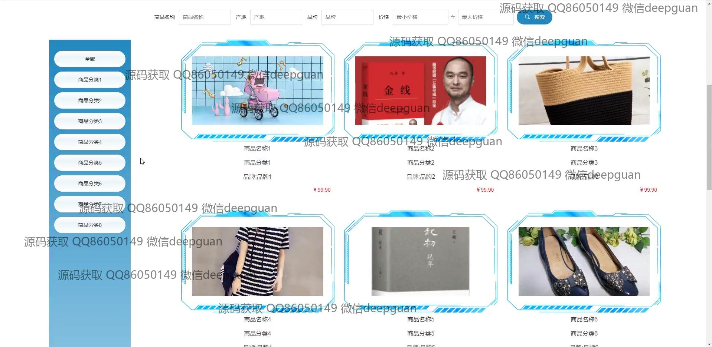
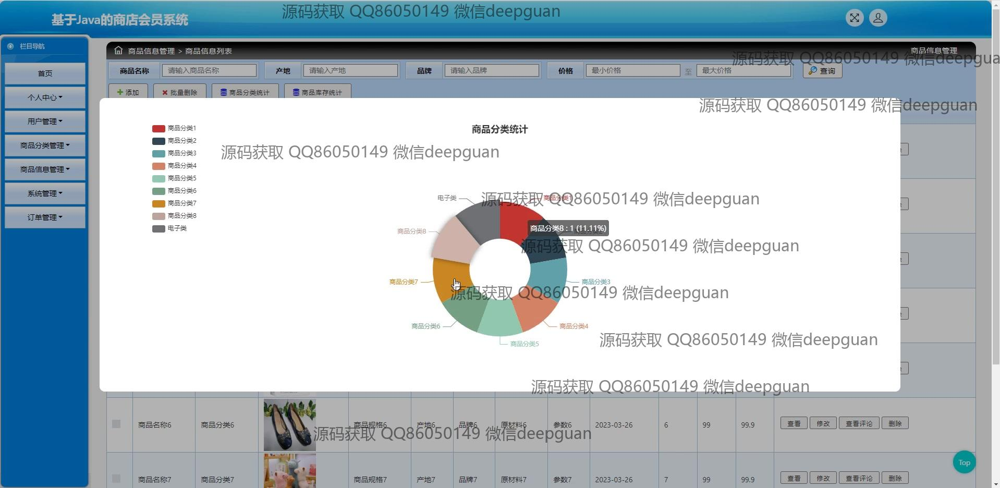
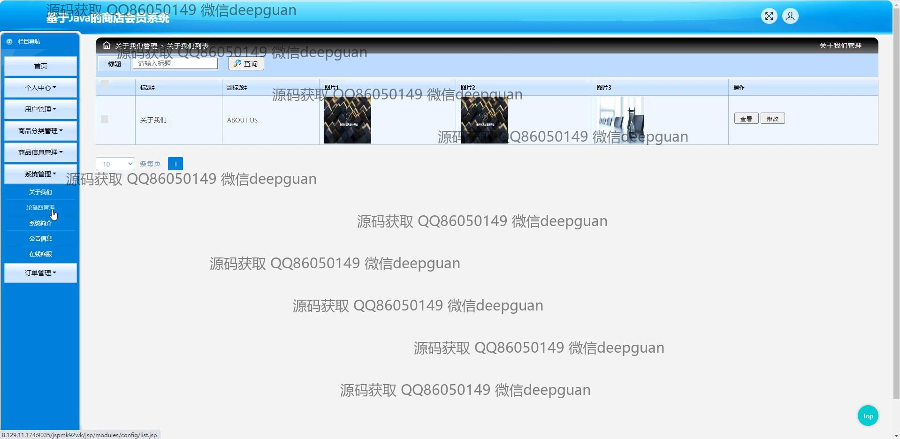

<h1 align="center">基于Java的商店会员系统</h1>

## 简介
商店会员系统：角色分为管理员、用户；提供用户管理、商品管理、订单管理、充值、数据统计、公告信息管理等功能，支持商品浏览、购物车、积分查询、评论交互等操作。    --计算机毕业设计源码；毕设源码；java毕业设计源码

## 联系方式

<h3 align="center">获取完整代码与数据库文件 + 微信：deepguan QQ: 86050149 QQ群: 783742310</h3>

<h3 align="center">可帮忙远程部署 包运行成功！提供远程部署、修改代码、设计文档指导、代码讲解等服务！</h3>

## 功能介绍（完整见运行截图）
管理员：基本功能包括登录、注册和退出。系统首页展示主导航栏、商品推荐及数据可视化图表。商品管理涉及分类管理、信息录入与编辑以及库存统计。订单管理允许查看、编辑和统计订单信息，支持搜索和数据导出。公告和客服功能提供文本编辑与交互界面，提升商店管理效率。

用户：用户具备登录、注册和退出等基本功能。首页提供导航栏、商品推荐及公告信息。用户可浏览商品列表，通过搜索筛选商品并查看详细信息，添加商品到购物车并进行结算。个人中心功能支持管理和更新个人信息、查看订单历史，提高购物体验和便捷性。

## 运行截图

本代码来源于网络,仅供学习参考使用!

